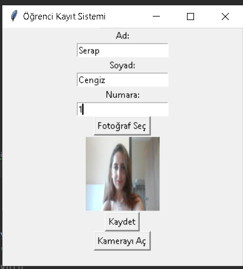
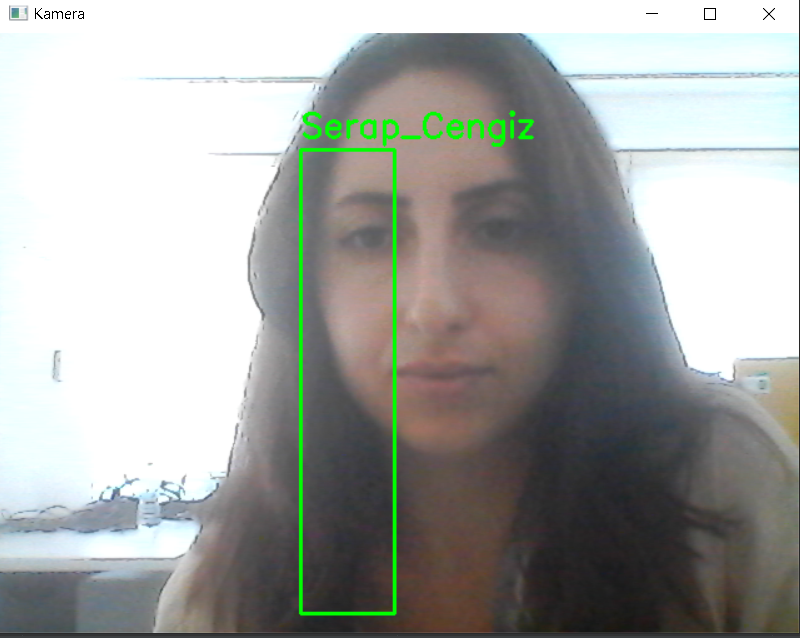

# Face Recognition
Projenin amacı görüntülü giriş takibi yapabilmek. İşyerlerinde,okullarda(devamsızık takibi) giriş yapıldığını kontrol etmek için geliştirdim.
    
1)Öncelikle kişinin bilgisini açılan arayüze giriyoruz.Bir kişi bir kez kaydetmek yeterli.
  

2)Sonra Kamera Aç butonu ile kamera açılır ve kişiyi tespit eder.
  

3)Tespit ettikten sonra kişinin bilgilerini ve günün tarihini yazarak geldiğini yazar.
